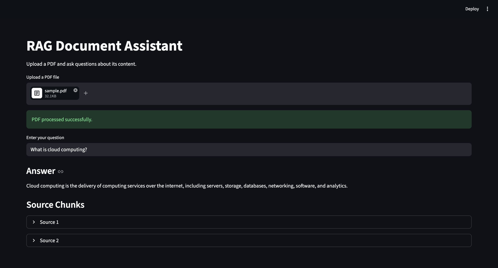

# RAG Document Assistant

AI-powered document Q&A app using Retrieval-Augmented Generation (RAG).

---

## 🚀 Features

* Upload a PDF and ask questions
* Semantic search using vector embeddings
* Context-aware answers with source attribution

---

## ⚙️ Tech Stack

Python • Streamlit • LangChain • FAISS • OpenAI • Docker

---

## 🏗️ How it works

PDF → Chunk → Embed → Store → Retrieve → Answer

---

## 📸 Demo



---

## ▶️ Run locally

```
pip install -r requirements.txt
streamlit run app.py
```

---

## 🐳 Docker

```
docker build -t rag-app .
docker run -p 8501:8501 rag-app
```

---

## 🌐 Live Demo

[RAG Document Assistant](https://rag-document-assistant-dysnwr4pxpnxsuv2pcpbpe.streamlit.app/)

---

Built as part of hands-on exploration in AI, Cloud, and Automation.
